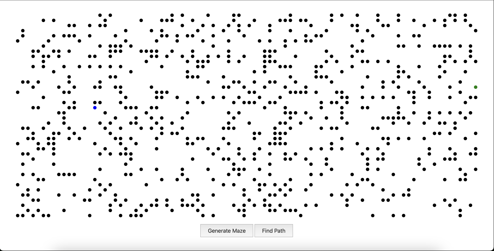
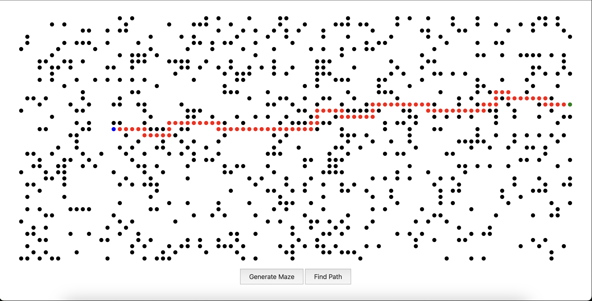

# Maze Pathfinding Visualization

This project is a simple pathfinding visualization that generates a random maze and finds a path from a starting point to an endpoint using the A* algorithm. The project is interactive, allowing users to see the generated maze, set start and end points, and observe the algorithm as it finds the shortest path.

## Project Overview

### Maze Generation

The grid is represented as a 2D array, where:
- `1` represents walls (unwalkable cells).
- `0` represents open paths (walkable cells).
  
The maze is randomly generated by filling cells with either walls or paths, with the start and end points assigned to random open cells. 

### A* Pathfinding Algorithm

The A* algorithm is used to find the shortest path between the start and end points. Here’s how it works in this project:
- **Heuristic**: Manhattan distance is used to estimate the distance between cells.
- **Path Calculation**: The algorithm calculates a path by continuously evaluating neighboring cells, selecting the cell with the lowest total cost (`f = g + h`, where `g` is the distance from the start and `h` is the heuristic).
- **Path Visualization**: The discovered path is visualized by highlighting each step with a delay, giving the appearance of animation.

### Features

- **Random Maze Generation**: Each maze is randomly generated to ensure unique paths.
- **Start/End Points**: Start and end points are randomly assigned but can be modified manually.
- **Interactive Path Visualization**: The path from start to end is displayed with a delay to visualize the algorithm’s progress.

## Usage

1. Open the HTML file in a web browser.
2. Click **Generate Maze** to create a new maze layout.
3. Click **Find Path** to see the algorithm find and display the shortest path.
4. The maze and pathfinding process are animated, allowing users to follow the steps of the algorithm visually.

## Screenshots

Below are examples of the maze and pathfinding visualizations:

*Randomly generated maze with walls and open paths.*

*Path from start to end after completion.*

## Possible Improvements

- **Enhanced Maze Generation**: Implement more structured algorithms, like Recursive Division, for complex mazes.
- **Manual Point Selection**: Add a feature to allow users to manually select start and end points.
- **Pathfinding Optimization**: Use a priority queue for faster selection of nodes during pathfinding.
- **Difficulty Levels**: Allow users to select maze difficulty by adjusting wall density or structure.

## Technology Stack

- **JavaScript** for maze generation and pathfinding logic.
- **HTML & CSS** for layout and visual styling of the maze and path.

